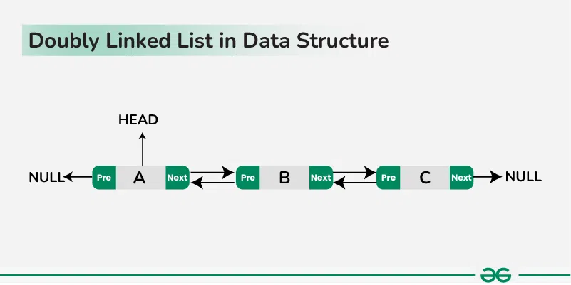

# Doubly Linked List

In this section we will talk about doubly linked list in detail. Doubly Linked List is an example of Singly Linked List , or let's just say , Linked List. In Linked List we had a reference pointer in each node , which pointed to the next node , but there was no provision for node to point backwards. So if a person was on current node and he needed to access the previous node , he need to do a new traversal . To solve this issue , we will use Doubly Linked List , which contains one more reference along with the `next` reference and this extra reference is called `previous`.

In the picture you can clearly see that we have two reference items now. For the head , the `previous` pointer will remain null. For the last / tail node , the next pointer will remain empty.