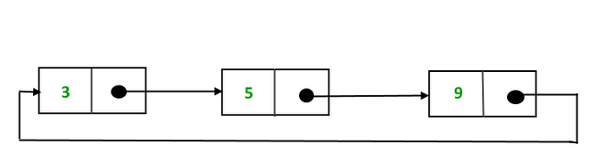

# Circular Linked List

This is is just a small modification of the singly linked list , where last node's `next` pointer is not null , rather it is set to the head node.

As you can see in the above example, the last node again points to the head node. By this point of life , you must be aquainted with basic features of linked list. So it will be easy to write the codes now.

## Insertion at front

- Inserting at front means , you will create a node and assign the `next` of this node to the previous head and replace the head variable with this node.

- Now you will traverse to the last node and change it's pointer to next node.

## Insertion at end

- Traverse to the last node , create a new node .
- The previous node , which was the last node earlier , will have it's `next` pointing towards this new last node.
- The `next` of new last node will point towards head.

## Deletion at 