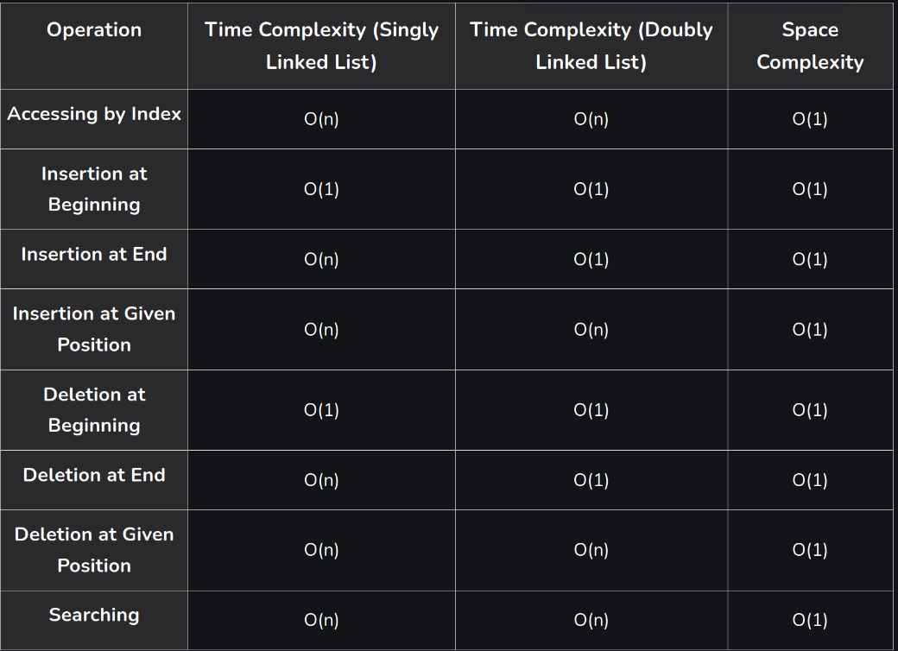

# Linked List

In this module we will talk about a better method to implement list function . It's called linked list. Basically in lists , you use indexing to traverse the arrays , but in linked list you use links to traverse the array. It's just like following railway compartments. 


as you can check in the image that a single data element is called `Node` . The first node in any LinkedList is called `head` . It contains information or the value of the data of current head and a pointer to the location of the next head. Same goes for the next head. The pointer location in the last head is genrally empty.

## Benefits of linked list over normal list 

- *Dynamic data structure:* A linked list is a dynamic arrangement so it can grow and shrink at runtime by allocating and deallocating memory. So there is no need to give the initial size of the linked list.
- *No memory wastage:* In the Linked list, efficient memory utilization can be achieved since the size of the linked list increase or decrease at run time so there is no memory wastage and there is no need to pre-allocate the memory.
- *Implementation:* Linear data structures like stacks and queues are often easily implemented using a linked list.
- *Insertion and Deletion Operations:* Insertion and deletion operations are quite easier in the linked list. There is no need to shift elements after the insertion or deletion of an element only the address present in the next pointer needs to be updated. 
- *Flexible:* This is because the elements in Linked List  are not stored in contiguous memory locations unlike the array.
- *Efficient for large data:* When working with large datasets linked lists play a crucial role as it can grow and shrink dynamically.
- *Scalability:* Contains the ability to add or remove elements at any position.

## How to create a Linked list in python

Linked list is not a default data type for python . For a linked list , you need to use your own logic to create a data structure. In this section i will give you a breif break-down on how to create your own linked list.

```python

# Using a class we can create the Node of the LinkedList

class Node :
  
  # We will initiate this Node by defining the element and the pointer through __init__ constructor

  def __init__(self , element = None , nxtPointer = None) :
    
    self.element = element
    self.nxtPointer = nxtPointer
```  
### Creating a LinkedList class

Now that we have our Node class, we can use it to create our LinkedList class. The LinkedList class will have a single head element which points to the first node in the list.

```python
class LinkedList:
    def __init__(self):
        self.head = None
```

### Adding a Node
We can add a node to our linked list by creating a new Node and setting it as the head if the list is empty, or by traversing the list and adding the new Node at the end.

```python

# Create a new class LinkedList , which will use Nodes to store data .

class LinkedList:

    # Initiate the head of the LinkedList
    def __init__(self):
        self.head = None

    #This method will help you to add an element at the head position of the linked list
    def add_from_front(self, element):
        node = Node(element , self.head) # assign a Node to a variable and use the previous head as the pointer
        self.head = node # update the assigned node as the new head. 

    #This method will print the Linked List
    def print(self):
        if self.head == None :
            print('The Linked List is empty')
        else :
            #Fetch the head of the Linked List
            itr = self.head
            llist = ''

            while itr :
                llist = str(itr.element) + '-->'
                itr = itr.nxtPointer # Now the pointer of head will lead you to next node.
            print (llist)
```

## Space and Time complexity for linked Lists

### Time Complexity of Searching (Finding an Element) in Linked List:

- **Best Case: O(1) –** If the element is found at the head of the list.
    In the best case, the target element is located at the beginning of the linked list, so only one comparison is needed to find it.
- **Worst Case: O(n) –** If the element is at the end of the list or not present.
    In the worst case, the target element is either at the end of the list, requiring traversal through all elements, or not present at all, resulting in full traversal.
- **Average Case: O(n) –** Similar to the worst case, as each element may need to be checked on average.
    On average, the target element could be located anywhere within the list, requiring traversal through approximately half of the elements.

### Time Complexity of Insertion (Adding an Element) in Linked List:

- **Best Case: O(1) –** If inserting at the beginning of the list.
    Insertion at the beginning requires updating the head pointer, which can be done in constant time.
- **Worst Case: O(n) –** If inserting at the end or in the middle of the list, requiring traversal.
    Inserting at the end or in the middle of the list requires traversing to the appropriate position, which may involve visiting all elements.
- **Average Case: O(n) –** Similar to the worst case, as traversal may be needed on average.
    On average, insertion could occur anywhere within the list, requiring traversal through approximately half of the elements.

### Time Complexity of Deletion (Removing an Element) in Linked List:

- **Best Case: O(1) –** If deleting the first element.
    Deletion of the first element only requires updating the head pointer, which can be done in constant time.
- **Worst Case: O(n) –** If deleting the last element or one in the middle, requiring traversal.
    Deleting the last element or one in the middle requires traversal to locate the target element, which may involve visiting all elements.
- **Average Case: O(n) –** Similar to the worst case, as traversal may be needed on average.
    On average, the target element could be located anywhere within the list, requiring traversal through approximately half of the elements.

### Time Complexity of Traversal in Linked List: O(n)

- Each element needs to be visited once to perform any operation.

### Time Complexity of Accessing (Getting/Setting) an element in Linked List: O(n)

Typically O(n), as access requires traversal from the head to the desired position.
Accessing an arbitrary element in the linked list requires traversal from the head to the desired position, which may involve visiting all elements.


